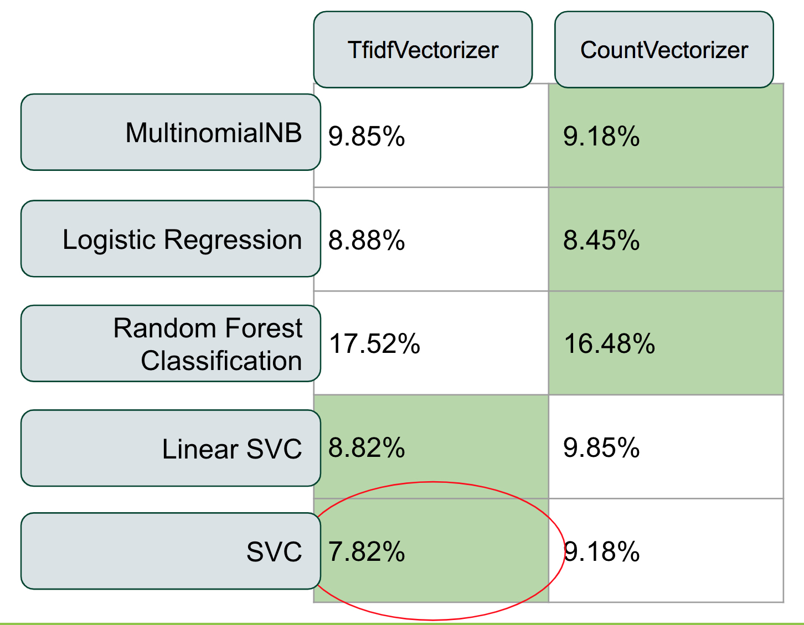
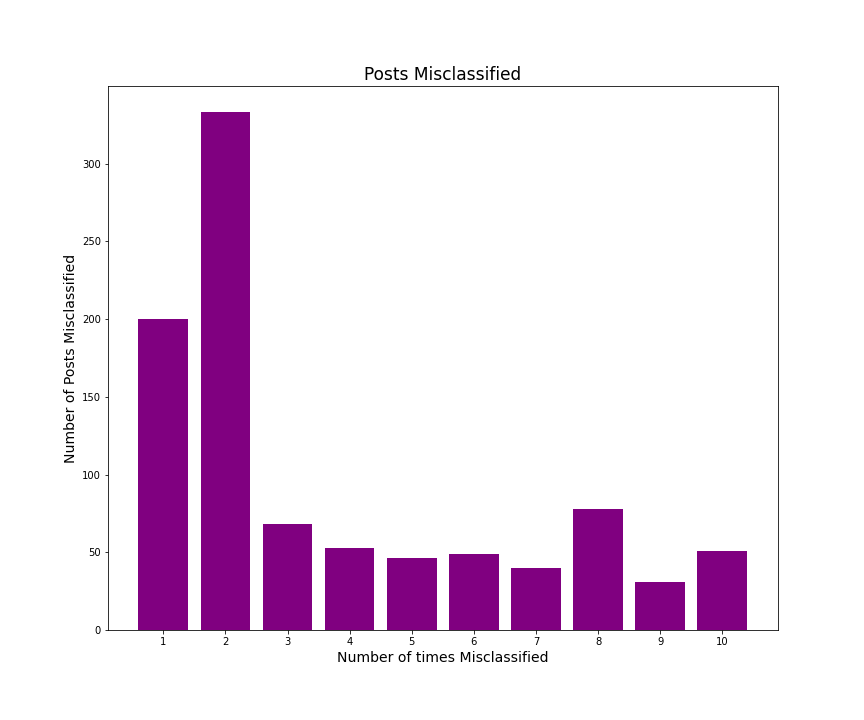

#  Project 3: Reddit Text Classification

### Problem Statement
Do varying classification models misidentify similar subsets of data when predicting whether a post will belong to r/Plants or r/Cats subreddits? Or do the subsets of misidentified posts vary by model?

---
### Background Research

When selecting models to use for classifying language data, different models perform differently. When beginners start to use and score models, it may be a misconception that the errors in each model overlap. That is to say that when selecting models with smaller scores, each error in that model is also found in the error of the worse performing model. I used this project to explore that assumption, and identify which posts were the most difficult for a machine learning model to identify and classify correctly.

This project focuses on classifying two subreddits, r/Plants and r/Cats. Both subreddits are primarily comprised of photo posts, with minimal text in the submission itself. I chose these subreddits per personal interest, and because in these times of quarantine and uncertainty, both pet adoptions and houseplant purchases have skyrocketed according to the [Washington Post](https://www.washingtonpost.com/nation/2020/08/12/adoptions-dogs-coronavirus/) and [The Chicago Tribune](https://www.chicagotribune.com/lifestyles/ct-life-plants-covid19-mental-health-0810-tt-20200812-poo7mh5qkbhhhayaldan5fhmk4-story.html). They both bring joy and comfort, and I expected many people to use similar language to describe them.

---
### Datasets Used
name|description
---|---
reddit_data.csv| Created using Pushshift's API for reddit, 5,000 rows from r/Plants and r/Cats submissions
misclass_and_model.csv| Created during model fitting to record best scores and the index value of each misidentified post

---

### Analysis Summary

The title text from 10,000 reddit posts pulled using Pushshift's API for reddit were tokenized using RegexpTokenizer in order to remove punctuation before lemmatizing the text data. The data was then split into training and test datasets before handing off to one of ten models. Each model was a permutation of either CountVectorizer or TfidfVectorizer to transform the language data into numeric data and one of five classification models: Multinomial Naive Bayes, Logistic Regression, Random Forest Classifier, Linear Support Vector Classification, and Support Vector Classification.  In the figure below are the misclassification scores for each permutation of the transformers and models.

The Support Vector Machine models (Linear SVC and SVC) performed very well on test data, although the Support Vector Classifier (with an 'rbf' kernel) produced the model with the highest score on the test data and the lowest misclassification rate overall (circled in red). This model attained a specificity of 90%, and sensitivity of 94%. In this model, specificity indicates how many posts from the Plants subreddit were correctly as Plants posts, and sensitivity the opposite, or how many Cats posts were correctly identified. The difference here tells us that it is more often that the model misclassifies a post as belonging to Cats, when it actually belongs to Plants. This difference is reflected in the misclassification frequencies discussed below. As I did not drop rows from my original dataframe, the baseline score for this analysis is 50%, every model performed well above the baseline.

I also found it interesting that in both Support Vector Machine models, TfidfVectorizer outperformed CountVectorizer's transformation of the data. TfidfVectorizer applies an additional level of scoring on the corpus, which might help the Support Vector machine differentiate values more distinctly than a matrix of integer counts from CountVectorizer when using an 'rbf' kernel. That said, CountVectorizer also performed well with the data although the SVC model identified used a 'linear' kernel.

---

### Conclusions & Considerations

For each model permutation, I recorded the misclassified posts. After fitting all 10, each post's misclassification frequency was plotted in the following histogram.

Although I expected a somewhat more normal or left skewed graph, indicating that most misclassified posts were misclassified in every model, the data skews right. Most posts were only misclassified twice, although overall 29% of the test data was part of a misclassification subset at least 1 time. Indicating that many posts were only misidentified by a single model rather than ever model. Contrary to how I and other beginner Data Scientists might understand error, the subset of misidentified data varies between different models. That is to say that not ever model misses the same posts, and some posts may be perfectly classified in one model, but misidentified in another.

Of the misidentified posts 61% were from the Plant subreddit, misclassified as Cat posts. This trend was evident in the specificity score of the best model, showing that it was easier for the model to correctly identify cat reddit posts, but that plant posts were more often misidentified. Personally, this is in line with my expectations. As the owner of plants and cats, I can see other people talking about their plants more like they are pets, than talking about their cats like they are plants. I don't often water my cats although I frequently move them to receive more sunlight.

In future iterations of this project I would be interested to understand what causes the slight uptick on each 'even' bar in the histogram. My hypothesis for this analysis would be that if a model is going to misclassify a post using one transformer, it is more likely to also misclassify that post using the other transformer, and the error comes from within the model, not within the transformer.

---

### Sources Cited:
[Pushshift's Api Documentation](https://github.com/pushshift/api)

[r/Plants](https://www.reddit.com/r/Plants)

[/Cats](https://www.reddit.com/r/Cats)
